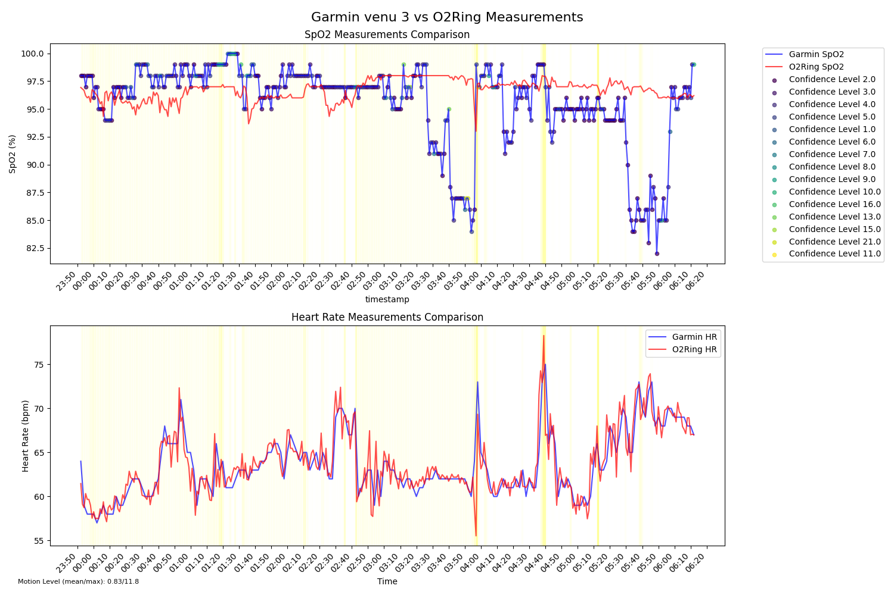

# Garmin vs O2Ring Data Comparison

This is my little vibe coding python project made with Cursor AI to compare SPO2 and heart rate data between my Garmin Venu 3 and Viatom O2Ring device.
It includes scripts for parsing the raw data files and creating visualizations for analysis.


## Requirements

```bash
pip install -r requirements.txt
```

## Usage
Garmin data can be exported from https://connect.garmin.com/ using the endpoint:
https://connect.garmin.com/sleep-service/sleep/dailySleepData?date=2025-03-07&nonSleepBufferMinutes=60


1. Place your data files in a directory with the following naming convention:
   - `garmin*-pulse.json`: Garmin heart rate data
   - `garmin*-spo2.json`: Garmin SpO2 data
   - `O2Ring_*.csv`: O2Ring data


2. Parse and merge the data:
```bash
python parse.py /path/to/data/directory
```
This will create a merged CSV file in the same directory.

3. Create visualizations:
```bash
python plot.py /path/to/data/directory/merged_data.csv
```

Optional: Save the plot to a file:
```bash
python plot.py /path/to/data/directory/merged_data.csv --output plot.png
```

## Output

The visualization includes:
- SpO2 comparison plot with confidence levels
- Heart rate comparison plot
- Motion detection overlay
- Statistical summaries in the console output

## Data Format

### Input Files

- Garmin JSON files should contain:
  - SpO2 readings with confidence levels
  - Heart rate measurements with timestamps
- O2Ring CSV should contain:
  - SpO2 readings
  - Pulse rate
  - Motion detection values

### Output Files

- Merged CSV file with synchronized 1-minute resolution data
- Optional PNG visualization file

## Example Visualization

Below is an example output showing the comparison between Garmin Venu 3 and O2Ring measurements over a night's sleep:


